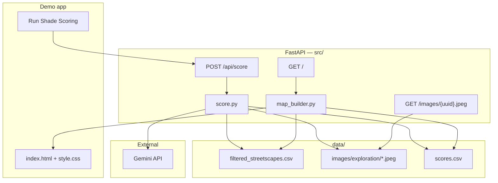

# ShadeScapes

A vision-language model (VLM) prototype that scores pedestrian shade from street-level imagery and maps the results for a Singapore corridor.

**Demo video:** [add Loom URL here]

---

## Problem

Singapore's Urban Heat Island effect makes afternoon walking uncomfortable and raises health risks for vulnerable groups. Planners at NParks, URA, and GovTech need to know where sidewalks lack shade — not from satellite canopy alone, but from the pedestrian's point of view. Covered linkways, building overhangs, and tree canopy at specific angles all matter, and top-down GIS often misses them.

**Stakeholder:** NParks / URA / OneMap team  
**User story:** *Which street segments feel hottest to walk at 3pm, and where should we plant trees or add shade structures?*

---

## Architecture

ShadeScapes turns unstructured street photos into a structured **Shade Index** (`pedestrian_shade_score`, 0–1) and displays it on an interactive map. The VLM is the core AI component — there is no composite formula over GVI/SVI; the model's judgment *is* the index.



### Components

| Layer | Path | Role |
|-------|------|------|
| **Scorer** | `src/score.py` | Discovers images, calls Gemini with a fixed JSON schema, validates responses, writes `data/scores.csv` |
| **Map** | `src/map_builder.py` | Joins metadata + scores on `uuid`, builds a Folium map with colour-coded markers and rich HTML popups |
| **API** | `src/main.py` | Serves the map, triggers batch scoring, serves exploration images |
| **Frontend** | `templates/index.html`, `static/style.css` | Minimal UI — one button, status line, embedded map |

### VLM contract

Each image is scored with `gemini-3.1-flash-lite` (override via `GEMINI_MODEL`). The prompt anchors to **afternoon pedestrian shade on the walkable path** and passes `heading` and `hour` from metadata when available.

```json
{
  "pedestrian_shade_score": 0.72,
  "shade_sources": ["street_trees", "building_overhang"],
  "confidence": "high",
  "reasoning": "Dense canopy over left sidewalk; building shadow covers right side."
}
```

Scoring runs in parallel batches (rate-limited to 15 requests/min). Already-scored images are skipped unless `POST /api/score?force=true`.

### Demo vs evaluation paths

The demo and eval pipelines share `src.score.score_image` but use **separate data directories** so reviewers can re-score the demo without touching eval artifacts.

| | Demo app | Evaluation |
|---|----------|------------|
| Images | `data/images/exploration/` (9) | `data/images/sample/` (~50) + `data/images/synthetic/` (7) |
| Scores | `data/scores.csv` | `eval/data/scores.csv` |
| Trigger | Button in browser | `uv run python -m eval.score_eval` |
| Purpose | Live "AI runs on click" demo | Human-label comparison, stability, error analysis |

### Repository layout

```
shadescapes/
├── src/                  # FastAPI app, VLM scorer, map builder
├── templates/            # Jinja2 HTML
├── static/               # CSS
├── data/
│   ├── filtered_streetscapes.csv
│   ├── images/exploration/   # demo subset
│   ├── images/sample/        # eval image pool
│   └── images/synthetic/     # generated gap-fill images
├── eval/
│   ├── evaluation.ipynb      # full eval report (saved outputs)
│   ├── score_eval.py         # batch score eval set
│   ├── collect_run_variance.py
│   ├── generate_images.py
│   └── data/                 # labels, scores, stability runs
├── Dockerfile
├── compose.yaml
└── PROCESS.md
```

---

## Evaluation

**Claim:** VLM `pedestrian_shade_score` agrees with human shade judgment on a hand-labeled sample of streetscape images.

**Why this methodology:** Hand labels are a direct proxy for the construct we care about — *functional shade on the walkable path*. Spearman ρ is the primary metric because it is robust to scale differences between human ratings (1–5) and VLM output (0–1). We deliberately avoid LLM-as-judge (circular) and dropped GVI/SVI baseline comparison to stay within time budget; stability and category-level error analysis add depth instead.

Full methodology, charts, and mismatch galleries are in [`eval/evaluation.ipynb`](eval/evaluation.ipynb).

### Setup

- **Ground truth:** Single rater hand-labeled images on a 1–5 afternoon pedestrian shade scale (`eval/data/human_labels.csv`), normalized to 0–1. Joined eval set: 34 images (27 real + 7 synthetic).
- **Corridor:** One ~500 m cluster in western Singapore (campus / hospital / residential mix), filtered from [Global Streetscapes](https://huggingface.co/datasets/NUS-UAL/global-streetscapes).
- **Eval set:** 27 real Mapillary images + 7 synthetic gap-fill images (building shadow, HDB linkway, etc.) generated to cover underrepresented `scene_category` values. **Headline accuracy metrics use real images only.**

### Results

| Tier | What it measures | Result |
|------|------------------|--------|
| **A — Accuracy** | VLM vs human (Spearman ρ, MAE) | **ρ = 0.527, MAE = 0.263** (n = 27 real images) |
| **B — Stability** | Same image scored 3× (10-image subset) | Median run std = 0.00, max range = 0.15, test–retest ρ = 0.97, 0% high-variance images |
| **C — Error analysis** | Mismatches (error > 0.25) with visuals | 11 mismatches: tree_canopy (6), mixed_sources (2), ambiguous_path (1), covered_walkway (1), open_exposure (1) |

### Key findings

- **Moderate agreement with humans** — ρ ≈ 0.53 suggests the VLM captures rank-order shade reasonably well on this corridor, but is not production-ready without more data and calibration.
- **`tree_canopy` is the hardest category** — most mismatches cluster here; dappled light and off-path greenery confuse both rater and model.
- **`open_exposure` is generally accurate** — important for flagging truly hot corridors.
- **Covered walkways split rater and model** — linkways technically provide full shade, but visible sun patches in frame led the human rater to score lower while the VLM scored high; the model may be closer to the intended construct here.
- **Label uncertainty matters** — roughly half of Tier C errors are on images the rater was also unsure about; ambiguous framing drives disagreement as much as model failure.
- **Run stability is good on the tested subset** — scores are repeatable across API calls, so disagreement with humans is more likely about correctness than noise.

### Reproduce

```bash
# Score eval images (requires GOOGLE_API_KEY)
uv run python -m eval.score_eval

# Collect run variance for Tier B
uv run python -m eval.collect_run_variance

# Open the notebook (saved outputs visible offline)
uv run jupyter notebook eval/evaluation.ipynb
```

---

## Data story

| | |
|---|---|
| **Source** | [NUS-UAL/global-streetscapes](https://huggingface.co/datasets/NUS-UAL/global-streetscapes) — Mapillary street-level imagery with pre-computed GVI/SVI and contextual metadata |
| **Filter** | `country == SG`; spatial cluster around one corridor (~53 metadata rows, ~50 downloaded images) |
| **Demo subset** | 9 images in `data/images/exploration/` for fast iteration and live scoring |
| **Eval subset** | Author-curated ~30 real images from `sample/` plus 7 synthetic images for category gaps (`building_shadow`, true `covered_walkway`, etc.) |
| **Licensing** | Mapillary imagery per source terms; dataset CC-licensed |
| **Privacy** | Public street-level photos; no additional face/plate processing beyond what Mapillary publishes |
| **Synthetic** | 7 images generated via Gemini Imagen for eval stress tests only — not shown on the demo map |

Images are committed to the repo. Metadata lives in `data/filtered_streetscapes.csv` (real) and `data/synthetic_streetscapes.csv` (generated).

---

## How to run

### Prerequisites

- Docker and Docker Compose
- A [Google AI API key](https://aistudio.google.com/apikey) with Gemini access

### Steps

```bash
git clone <your-repo-url>
cd shadescapes

# Create .env in the project root
echo "GOOGLE_API_KEY=your_key_here" > .env
# Optional: echo "GEMINI_MODEL=gemini-3.1-flash-lite" >> .env

docker compose up --build
```

Open [http://localhost:8000](http://localhost:8000). Click **Run Shade Scoring** to call the VLM on the 9 exploration images. Markers turn green (shaded) → yellow → red (exposed); click a marker for the score, shade sources, confidence, reasoning, and thumbnail.

### Local development (without Docker)

```bash
uv sync
echo "GOOGLE_API_KEY=your_key_here" > .env
uv run uvicorn src.main:app --reload --host 0.0.0.0 --port 8000
```

### Tests

```bash
uv run pytest                    # unit tests (no API calls)
uv run pytest -m integration     # live Gemini tests (requires GOOGLE_API_KEY)
```

---

## Limitations

- **Single corridor, small N** — results do not generalize island-wide.
- **Single human rater** — no inter-rater reliability; label noise is real, especially on `tree_canopy` and covered walkways.
- **Static snapshots** — scores assume afternoon tropical sun in the prompt; no solar geometry or time-of-day modelling. A photo taken at 11am does not tell you shade at 5pm.
- **Low sidewalk framing** — most images are road-centric with low `sidewalk_pct`; the walkable path is often a thin strip at the bottom of the frame.
- **API dependency** — demo requires a live Gemini API key and network access; not fully offline.
- **Synthetic images** — supplementary for error analysis only; excluded from headline accuracy metrics.
- **No Cool Route yet** — map shows point-level shade; Dijkstra max-shade routing is a natural next step for OneMap integration.

---

## Deployment considerations

**Who would run this:** A GovTech or agency data team (NParks, URA) operating a batch scoring pipeline over curated street imagery, with results served via an internal map tile service or OneMap layer — not citizens running inference locally.

**Compute and cost:** The demo scores 9 images in ~12 s via API. At island scale (~500k street images), sequential Gemini calls would cost thousands of dollars and take days. Production would need batched open-weight VLMs on GPU, distillation to a smaller classifier, or sparse re-scoring on changed corridors only. Expect ~1–2 GB RAM for the FastAPI container; inference cost dominates.

**Monitoring:** Track VLM parse-failure rate, score distribution drift by `place`/`scene_category`, API latency and quota errors, and user-reported mismatches on known corridors. Flag low-`confidence` scores for human review before they feed planning decisions.

**The risk that keeps me up at night:** A planner acts on a "cool route" that was shaded in the Mapillary photo but is fully exposed at 5pm in June — wrong shade geometry from static snapshots with no sun-angle modelling. Someone walks the recommended path expecting relief and gets heat stress instead.

---

## Further reading

- [`docs/process.md`](docs/process.md) — build narrative, decisions dropped, where judgment was exercised
- [`eval/evaluation.ipynb`](eval/evaluation.ipynb) — full eval with Tier A/B/C outputs and image galleries
- [`docs/vlm-approach.md`](docs/vlm-approach.md) — problem framing and VLM rationale
