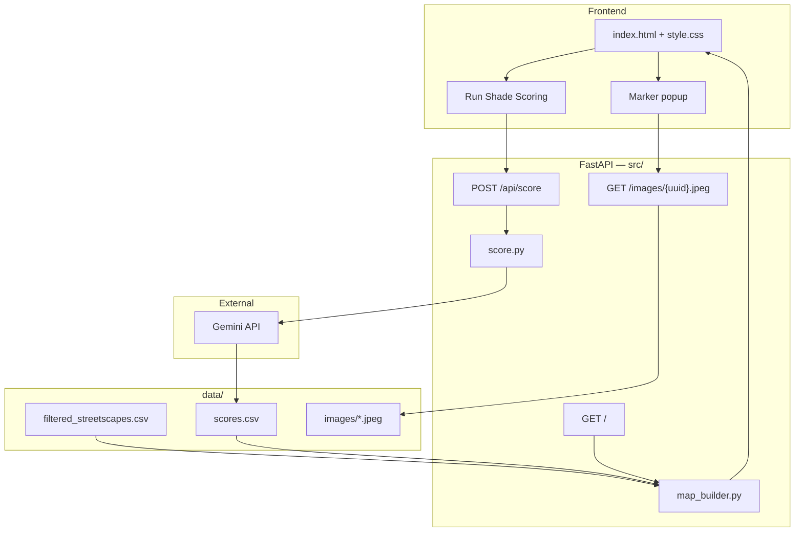

# ShadeScapes

A vision-language model (VLM) prototype that scores pedestrian shade from street-level imagery and maps the results for a Singapore corridor.

**Demo video:** [https://www.loom.com/share/9985216697b741d6bfc39071ba8a2e12](https://www.loom.com/share/9985216697b741d6bfc39071ba8a2e12)

---

## Problem

Singapore's tropical heat makes day walking uncomfortable and raises health risks for vulnerable groups. Planners at NParks and URA need to know where sidewalks lack shade — not from satellite canopy alone, but from the pedestrian's point of view. Covered linkways, building overhangs, and tree canopy at specific angles all matter, and top-down GIS often misses them.

**Stakeholder:** NParks / URA  
**User story:** *Which street segments feel hottest to walk in the day, and where should we plant trees or add sheltered walkways?*

---

## Architecture

ShadeScapes turns unstructured street photos into a structured **Shade Index** (`pedestrian_shade_score`, 0–1) and displays it on an interactive map. The VLM is the core AI component.




### Components


| Layer        | Path                                       | Role                                                                                                   |
| ------------ | ------------------------------------------ | ------------------------------------------------------------------------------------------------------ |
| **Scorer**   | `src/score.py`                             | Discovers images, calls Gemini with a fixed JSON schema, validates responses, writes `data/scores.csv` |
| **Map**      | `src/map_builder.py`                       | Joins metadata + scores on `uuid`, builds a Folium map with colour-coded markers and rich HTML popups  |
| **API**      | `src/main.py`                              | Serves the map, triggers batch scoring, serves exploration images                                      |
| **Frontend** | `templates/index.html`, `static/style.css` | Minimal UI — one button, status line (score progress), embedded map                                                     |


### VLM contract

Each image is scored with `gemini-3.1-flash-lite` (override via `GEMINI_MODEL` in `.env`). The prompt anchors to **pedestrian shade on the walkable path** and passes `heading` and `hour` from metadata when available.

```json
{
  "pedestrian_shade_score": 0.72,
  "shade_sources": ["street_trees", "building_overhang"],
  "confidence": "high",
  "reasoning": "Dense canopy over left sidewalk; building shadow covers right side."
}
```

Scoring runs in parallel batches (rate-limited to 15 requests/min). Already-scored images are skipped unless `POST /api/score?force=true`.

### Demo vs evaluation paths

The demo and eval pipelines share `src.score.score_image` but use **separate data directories** so reviewers can re-score the demo without touching eval artifacts.


|         | Demo app                     | Evaluation                                                                                        |
| ------- | ---------------------------- | ------------------------------------------------------------------------------------------------- |
| Images  | `data/images/sample/` (45)   | Noted in `eval/data/human_labels.csv` — `data/images/sample/` (30) + `data/images/synthetic/` (7) |
| Scores  | `data/scores.csv`            | `eval/data/scores.csv`                                                                            |
| Trigger | Button in browser            | `uv run python -m eval.score_eval`                                                                |
| Purpose | Live "AI runs on click" demo | Human-label comparison, stability, error analysis                                                 |


### Repository layout

```
shadescapes/
├── README.md
├── pyproject.toml              # dependencies, pytest config
├── Dockerfile
├── compose.yaml
├── .env                        # GOOGLE_API_KEY (not committed)
│
├── src/                        # application package
│   ├── __init__.py
│   ├── config.py               # paths, model name, env loading
│   ├── main.py                 # FastAPI routes
│   ├── score.py                # VLM batch inference → data/scores.csv
│   ├── map_builder.py          # Folium map + popups
│   └── models.py               # Pydantic schemas, domain errors
│
├── templates/
│   └── index.html              # map page + score button
├── static/
│   └── style.css
│
├── data/
│   ├── filtered_streetscapes.csv   # corridor metadata (53 rows)
│   ├── synthetic_streetscapes.csv  # metadata for generated eval images
│   ├── scores.csv                  # demo VLM outputs (written by app, not committed)
│   └── images/
│       ├── sample/                 # 45 JPEGs — image pool
│       └── synthetic/              # 7 PNGs — generated gap-fill for eval
│
├── eval/
│   ├── evaluation.ipynb        # full eval report (saved outputs)
│   ├── score_eval.py           # batch score eval set
│   ├── collect_run_variance.py # Tier B: repeated scoring for run stability
│   └── data/                   # labels, scores, stability runs
│
├── tests/                      # pytest unit + integration tests
└── docs/                       # design specs and build notes
```

---

## Data story


|                 |                                                                                                                                                                                                                                                             |
| --------------- | ----------------------------------------------------------------------------------------------------------------------------------------------------------------------------------------------------------------------------------------------------------- |
| **Source**      | [NUS Global Streetscapes](https://ual.sg/project/global-streetscapes/) — Mapillary street-level imagery with contextual metadata                                                                                                        |
| **Filter**      | `country = 'Singapore'`; `lighting_condition = 'day'`; `platform = 'walking surface'`; `quality = 'good'`; `weather = 'clear'`; `source = 'Mapillary'`; `Sidewalk > 0`; then spatial cluster around one corridor (~53 metadata rows, 45 downloaded images) |
| **Metadata**    | Per image in `data/filtered_streetscapes.csv`: `lat`, `lon`, `hour`, `heading`, `sidewalk_pct` — map placement, capture time/direction, and sidewalk share of frame |
| **Eval subset** | Author-curated ~30 real images from `sample/` plus 7 synthetic images for category gaps (`building_shadow`, true `covered_walkway`, etc.); each image hand-labeled for pedestrian shade (1–5) and `scene_category` |
| **Licensing**   | Mapillary imagery per source terms; dataset CC-licensed                                                                                                                                                                                                     |
| **Privacy**     | Public street-level photos; no additional face/plate processing beyond what Mapillary publishes                                                                                                                                                             |
| **Synthetic**   | 7 images generated via Nano Banana for testing edge cases (not included on the demo map)                                                                                                                                                                    |


A small set of sample images are committed to the repo for demo purposes. Metadata lives in `data/filtered_streetscapes.csv` (real) and `data/synthetic_streetscapes.csv` (generated).

---

## Evaluation

**Claim:** VLM `pedestrian_shade_score` agrees moderately with human shade judgment on a hand-labeled sample of streetscape images.

**Why this methodology:** Hand labels are a direct proxy for the construct we care about — *functional shade on the walkable path*. Spearman ρ is the primary metric because it is robust to scale differences between human ratings (1–5) and VLM output (0–1). We deliberately avoid LLM-as-judge (circular).

Full methodology, charts, and mismatch galleries are in [`eval/evaluation.ipynb`](eval/evaluation.ipynb).

### Setup

- **Ground truth:** Single rater hand-labeled each image for pedestrian shade (1–5, normalized to 0–1) and `scene_category` (`eval/data/human_labels.csv`). Joined eval set: 34 images (27 real + 7 synthetic).
- **Corridor:** One ~500 m cluster in western Singapore, filtered from [Global Streetscapes](https://huggingface.co/datasets/NUS-UAL/global-streetscapes).
- **Eval set:** 27 real Mapillary images + 7 synthetic gap-fill images (building shadow, HDB linkway, etc.) generated to cover underrepresented `scene_category` values. **Headline accuracy metrics use real images only.**

### Results


| Tier                   | What it measures                       | Result                                                                                                        |
| ---------------------- | -------------------------------------- | ------------------------------------------------------------------------------------------------------------- |
| **A — Accuracy**       | VLM vs human (Spearman ρ, MAE)         | **ρ = 0.527, MAE = 0.263** (n = 27 real images)                                                               |
| **B — Stability**      | Same image scored 3× (10-image subset) | Median run std = 0.00, max range = 0.15, test–retest ρ = 0.97, 0% high-variance images                        |
| **C — Error analysis** | Mismatches (error > 0.25) with visuals | 11 mismatches: tree_canopy (6), mixed_sources (2), ambiguous_path (1), covered_walkway (1), open_exposure (1) |


### Key findings

- **Moderate agreement with humans** — ρ ≈ 0.53 suggests the VLM captures rank-order shade reasonably well on this corridor, but is not production-ready without more data and calibration.
- **Run stability is good on the tested subset** — scores are repeatable across API calls, so disagreement with humans is more likely about correctness than noise.
- **`tree_canopy` is the hardest category** — most mismatches cluster here; dappled light and off-path greenery confuse both rater and model.
- **`open_exposure` is generally accurate** — important for flagging truly hot corridors.
- **Covered walkways split rater and model** — linkways technically provide full shade, but visible sun patches in frame led the human rater to score lower while the VLM scored high; the model may be closer to the intended construct here.
- **Label uncertainty matters** — roughly half of Tier C errors are on images the rater was also unsure about; ambiguous framing drives disagreement as much as model failure.

### Reproduce

```bash
# Score eval images (requires GOOGLE_API_KEY)
uv run python -m eval.score_eval

# Collect run variance for Tier B
uv run python -m eval.collect_run_variance

# Open the notebook (saved outputs visible offline)
uv run python eval/run_notebook.py
```

---

## How to run

### Prerequisites

- Docker and Docker Compose
- A [Google AI API key](https://aistudio.google.com/apikey) with Gemini access
- **Your own data:** street-level images and a filtered metadata CSV (`data/filtered_streetscapes.csv` in this repo). The CSV must join to images on `uuid` and include fields used for scoring and mapping (`lat`, `lon`, `hour`, `heading`, etc.). For this prototype, both are committed — JPEGs under `data/images/sample/` and the metadata file above. Replace or extend those paths in `config.py` to score a different corridor.

### Steps

```bash
git clone https://github.com/claudia-liauw/shadescapes
cd shadescapes

# Create .env in the project root
echo "GOOGLE_API_KEY=your_key_here" > .env

# Docker
docker compose up --build

# Alternative (no Docker)
uv sync
uv run uvicorn src.main:app --reload --host 0.0.0.0 --port 8000
```

Open [http://localhost:8000](http://localhost:8000). Click **Run Shade Scoring** to call the VLM on the 45 sample images. Markers turn green (shaded) → yellow → red (exposed); click a marker for the score, shade sources, confidence, reasoning, and thumbnail.

### Tests

```bash
uv run pytest                    # unit tests (no API calls)
uv run pytest -m integration     # live Gemini tests (requires GOOGLE_API_KEY)
```

---

## Limitations

- **Agreement with humans is only moderate** — Spearman ρ ≈ 0.53 and MAE ≈ 0.26 on 27 real images are useful for ranking corridors but not high enough for fine-grained planning without review. Future work can include switching to a better model, fine-tuning, tuning the prompt (e.g. few-shot prompting), or addressing below limitations.
- **Coverage** — Evaluation covers a small hand-labeled set from a single Singapore corridor; findings should not be read as island-wide.
- **Synthetic gap-fill** — Only seven generated images stress-test edge cases; their realism and use case fidelity could be improved.
- **Ground-truth noise** — One rater labeled all images. Images can be hard to judge even for humans, and sidewalks are frequently partial, obstructed, or pushed to the frame edge.
- **Score calibration** — Reasoning and numeric scores sometimes disagree (e.g. exposed path but score of 0.35). The model also returns `high` confidence on nearly every image.
- **API dependence** — Free-tier rate limits cap batches at 15 requests/min, so end-to-end scoring feels slow in the demo.
- **Operational scale** — Evaluation is manual and labour-intensive; production use would remain tied to external API availability, latency, and cost.

---

## Deployment considerations

**Who would run this:** A government agency data team (NParks, URA) batch-scoring a curated set of street images and metadata, with results served on an internal map. A citizen-facing variant — pick a shaded walking route from scored corridors — was explored early on but dropped for this prototype.

**Compute and cost (rough estimates):** Each batch scores 15 images in parallel via the Gemini API in **~2–12 s** (best case ~2 s when all calls land quickly; up to ~12 s when one straggler or JSON-retry call sets batch time). The demo is throttled to 15 requests/min on the free tier, so end-to-end scoring feels slow mostly from waiting between batches; a paid or production quota could run batches back-to-back at that ~2–12 s cadence. At island scale (~500k street images), API time is on the order of tens of hours at typical batch speeds, but could stretch toward ~100+ h if many batches hit the slow end — plus thousands of dollars in inference cost — so production would likely also need batched open-weight VLMs on GPU, distillation to a smaller classifier, or sparse re-scoring on changed corridors only. Expect ~1–2 GB RAM for the FastAPI container; inference cost dominates. See [`docs/deployment-estimates.md`](docs/deployment-estimates.md) for how these figures were derived.

**Monitoring:** Track API failure and parse-error rates, prediction latency, and quota exhaustion. Route low-`confidence` scores to human review before they inform planning. For ongoing analysis, a lightweight classifier could tag high-salience categories (e.g. `tree_canopy`, `covered_walkway`) without calling the VLM on every image. Collect optional user feedback — *does this score match what you see on the ground?* — to catch drift and build a correction loop over time.

**The risk that keeps me up at night:** A score looks authoritative but was derived from the wrong inputs: capture time does not match when people actually walk, the imagery is out of date, or the visible shade falls on the road rather than the walkable path. Someone plans or walks expecting relief that the photo never guaranteed.

---

## Further reading

- [PROCESS.md](PROCESS.md) — build narrative, decisions dropped, where judgment was exercised
- [eval/evaluation.ipynb](eval/evaluation.ipynb) — full eval with Tier A/B/C outputs and image galleries
- [docs/deployment-estimates.md](docs/deployment-estimates.md) — assumptions behind deployment time, cost, and RAM figures

