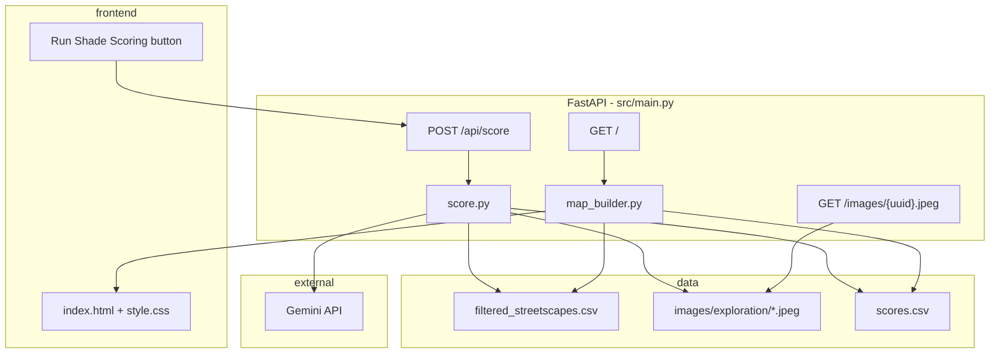

# ShadeScapes Backend & Frontend Design

**Date:** 2026-06-19  
**Status:** Draft for review  
**Scope:** VLM scoring pipeline + interactive map demo. Evaluation, Cool Route, and Docker deferred to later phases.

---

## Goal

Build a working prototype where a reviewer clicks **Run Shade Scoring**, the backend runs Gemini VLM inference on local street images, writes structured scores, and the frontend displays a Singapore corridor map with shade-coloured markers and rich popups (score, reasoning, thumbnail).

This is the AI-central demo core: unstructured street photos → structured shade index → planner-facing map.

---

## Data (development)

| Asset | Path | Notes |
|-------|------|-------|
| Metadata | `data/filtered_streetscapes.csv` | 53 rows; uuid, lat, lon, heading, GVI, SVI, place |
| Images | `data/images/exploration/*.jpeg` | 9 images; filename = `{uuid}.jpeg` |
| Scores (generated) | `data/scores.csv` | Written by scorer; not committed initially |

**Join rule:** Inner join on `uuid` (image stem). Only points with a local image appear on the map. Unscored images show as neutral/grey markers; scored images use the colour scale.

The 9-image subset is intentional for fast iteration. The same code paths work when more images are added to `exploration/`.

---

## Approaches considered

### A. FastAPI + server-rendered Folium (recommended)

FastAPI serves a Jinja2 page. Folium builds the map server-side. A POST endpoint triggers `score.py`, then the page reloads (or fetches fresh map HTML) with updated markers.

| Pros | Cons |
|------|------|
| Matches `concept.md` and existing Folium exploration | Popups are HTML strings, less flexible than a SPA |
| Minimal frontend code; ship in ~2 days | Full page refresh unless we add a small fetch |
| Folium colour scale + popups well-supported | |

### B. FastAPI JSON API + static Leaflet frontend

Backend exposes `/api/points` GeoJSON; vanilla HTML/CSS/JS renders Leaflet map client-side.

| Pros | Cons |
|------|------|
| Cleaner separation; richer popup UX | More JS than needed for take-home scope |
| No Folium dependency in render path | Departs from documented Folium approach |

### C. CLI-only scoring + static HTML map

`score.py` run manually; app only reads `scores.csv`.

| Pros | Cons |
|------|------|
| Simplest backend | No live "AI runs on click" demo moment |
| | Weakens "AI is central" narrative for reviewers |

**Decision:** **Approach A.** Keeps Folium, satisfies the button-triggered scoring flow, and stays finishable.

---

## Architecture



---

## Repository layout

```
shadescapes/
├── src/
│   ├── main.py           # FastAPI app, routes, static mount
│   ├── score.py          # VLM batch inference → scores.csv
│   ├── map_builder.py    # Folium map from joined data
│   ├── models.py         # Pydantic schemas for VLM JSON + API responses
│   └── config.py         # Paths, model name, env vars
├── templates/
│   └── index.html        # Header, score button, map iframe/embed
├── static/
│   └── style.css
├── data/
│   ├── filtered_streetscapes.csv
│   ├── images/exploration/
│   └── scores.csv        # gitignored or committed after first run
└── pyproject.toml        # add fastapi, uvicorn, jinja2
```

---

## Backend: `score.py`

### Responsibilities

1. Discover `*.jpeg` in `data/images/exploration/`.
2. Load metadata row per uuid from `filtered_streetscapes.csv`.
3. Call Gemini (`gemini-2.0-flash` or `gemini-2.5-flash` — use whatever is available via `google-genai`; concept references `gemini-3.1-flash-lite` when released).
4. Parse and validate JSON response.
5. Append/overwrite `data/scores.csv`.

### Guards

| Condition | Behaviour |
|-----------|-----------|
| No images in exploration folder | Raise `NoImagesError`; API returns 400 with clear message |
| `GEMINI_API_KEY` missing | Return 503: "API key not configured" |
| VLM returns invalid JSON | Retry once with "respond with JSON only"; on second failure log uuid and skip with error entry |
| Image exists but no CSV row | Skip with warning in response summary |

### VLM prompt (fixed schema)

Anchor to pedestrian sidewalk shade at 2–4pm tropical sun. Include `heading` from metadata when present.

**Output schema:**

```json
{
  "pedestrian_shade_score": 0.72,
  "shade_sources": ["street_trees", "building_overhang"],
  "confidence": "high",
  "reasoning": "Dense canopy over left sidewalk; building shadow covers right side."
}
```

| Field | Validation |
|-------|------------|
| `pedestrian_shade_score` | float 0.0–1.0 |
| `shade_sources` | list of strings (allow empty) |
| `confidence` | one of `low`, `medium`, `high` |
| `reasoning` | non-empty string, max ~500 chars |

`pedestrian_shade_score` **is** the Shade Index. No composite formula.

### Batch behaviour

- Process images sequentially (9 images ≈ seconds; avoids rate-limit bursts).
- Skip already-scored uuids unless `force=True` query param on POST.
- Return summary: `{ "scored": 7, "skipped": 2, "errors": ["uuid: reason"] }`.

### `scores.csv` columns

```
uuid,pedestrian_shade_score,shade_sources,confidence,reasoning,scored_at
```

`shade_sources` stored as JSON string or pipe-separated.

---

## Backend: `map_builder.py`

### Responsibilities

1. Load `filtered_streetscapes.csv`.
2. Load `scores.csv` if present (empty scores OK).
3. Filter to uuids with files in `data/images/exploration/`.
4. Build Folium map centred on mean lat/lon of points, zoom ~16.
5. Add `CircleMarker` or `Marker` per point:
   - **Colour:** green (score ≥ 0.7) → yellow (0.4–0.7) → red (< 0.4); grey if unscored.
   - **Popup HTML:** thumbnail (`/images/{uuid}.jpeg`), score, shade sources, confidence, reasoning, GVI/SVI, place.
6. Add legend (colour scale).

Return Folium map object; `main.py` embeds `_repr_html_()` in template or writes to a temp div.

---

## Backend: `main.py` (FastAPI)

### Routes

| Method | Path | Description |
|--------|------|-------------|
| `GET` | `/` | Render `index.html` with embedded map |
| `POST` | `/api/score` | Run scorer; return JSON summary |
| `GET` | `/images/{uuid}.jpeg` | Serve exploration image (404 if missing) |
| `GET` | `/health` | `{ "status": "ok" }` for Docker later |

### Static files

- Mount `static/` at `/static`.
- Images served from `data/images/exploration/` via dedicated route (data dir is gitignored; route reads from disk at runtime).

### Run command

```bash
uvicorn src.main:app --reload --host 0.0.0.0 --port 8000
```

---

## Frontend

### `templates/index.html`

- Semantic HTML5: header, main, map container.
- Title: **ShadeScapes** + one-line subtitle (pedestrian shade index, Singapore corridor).
- **Run Shade Scoring** button.
- Status area for POST response (e.g. "Scored 7 of 9 images").
- Map: full-width, `min-height: 80vh`; Folium HTML injected in `#map`.

### `static/style.css`

- Clean, minimal layout (GovTech-appropriate, not flashy).
- Button: disabled + spinner text while scoring.
- Status messages: success (green), error (red).
- Responsive: map fills viewport on mobile.

### Interaction flow

1. User opens `http://localhost:8000`.
2. Map shows 9 points (grey if no `scores.csv`, coloured if exists).
3. User clicks **Run Shade Scoring**.
4. JS `fetch POST /api/score`; button disabled.
5. On success: `location.reload()` or `fetch GET /` partial — **reload is acceptable for MVP**.
6. Map refreshes with coloured markers and popups.

No framework (vanilla JS only for the button fetch).

---

## Error handling

| Layer | Strategy |
|-------|----------|
| VLM parse | Retry once; per-image error in summary, don't fail entire batch |
| Missing API key | 503 before any API calls |
| Empty image folder | 400 with user-facing message |
| Missing scores.csv | Map renders unscored points only |
| Image 404 in popup | Omit thumbnail; show text fields |

---

## Dependencies to add

```toml
"fastapi>=0.115.0",
"uvicorn[standard]>=0.34.0",
"jinja2>=3.1.0",
```

Existing: `google-genai`, `folium`, `pandas`, `pillow`.

---

## Out of scope (this phase)

| Item | Phase |
|------|-------|
| Human labels + Spearman eval | Later |
| GVI/SVI baseline comparison | Later |
| Cool Route (Dijkstra max-shade path) | Later |
| Segment aggregation (~20m clustering) | Later; point-level is enough for demo |
| Dockerfile / docker-compose | Later (structure supports it) |
| Scoring all 53 CSV rows | When images are downloaded |
| Island-wide map | Never for prototype |

---

## Testing (manual, this phase)

1. Start app without `GEMINI_API_KEY` → button returns 503.
2. Start with empty exploration folder → button returns 400.
3. With 9 images, no scores → map shows 9 grey markers.
4. Run scoring with valid key → `scores.csv` created, markers colourised.
5. Click marker → popup shows image, score, reasoning.
6. Re-run scoring → skips already-scored unless `force=true`.

---

## Success criteria

- [ ] `uvicorn` serves map at `:8000` without manual steps beyond `uv sync` + env var.
- [ ] Button triggers live VLM inference (not pre-baked scores only).
- [ ] All 9 exploration images join to CSV and appear on map.
- [ ] Popups show score + reasoning + thumbnail.
- [ ] Empty/missing data handled gracefully.

---

## Risks & notes

- **Model name drift:** Pin to a known `google-genai` model id; document in README.
- **API cost:** 9 images negligible; note scale risk in README deployment section later.
- **Gitignored data:** Reviewers need images locally; document download/setup in README.
- **Temporal shade:** Static score assumes afternoon sun in prompt; documented limitation.
